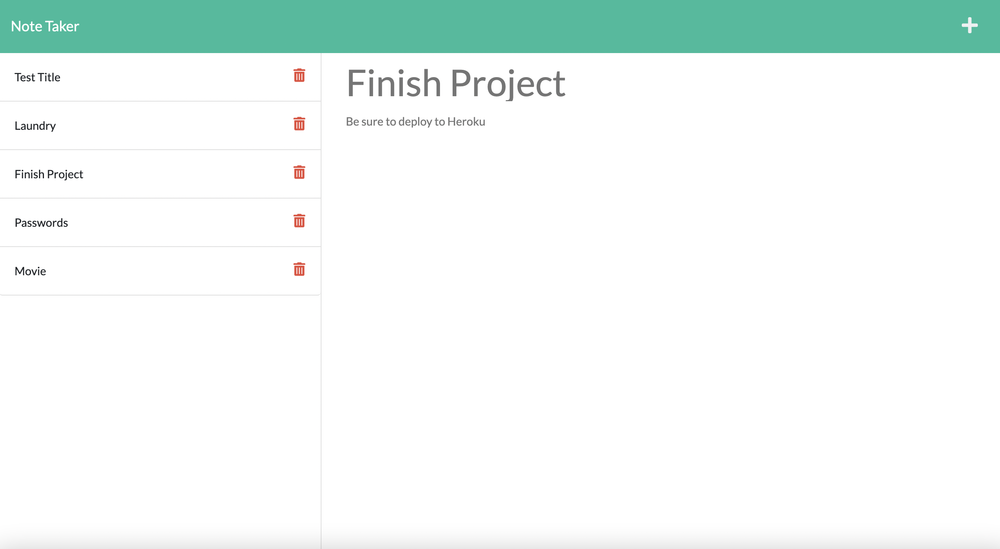

# Note-Taker-App

## Description

I was given code that I had to connect using a server. I also have to deploy the page using Heroku. I had to make sure the notes would display and be able to reopen if clicked on. I also added a delete feature for extra credit.

## Table of Contents

- [Installation](#installation)
- [Usage](#usage)
- [Credits](#credits)
- [License](#license)

## Installation

You have to install inquirer, and run npm i to make sure everything is up to date

## Usage

run the page with npm start or node server.js

[Link to Site](https://priddle88.github.io/Note-Taker-App/public/index.html)

## License

MIT

## Contributing

I used this weeks videos and referring to the README a lot for this assignment. I also used the MDN and node docs to help me. Google is always one of my biggest tools that I use as well.

## Questions

GitHub username: Priddle88

GitHub profile: [Link to Profile](https://github.com/Priddle88)

Reach out to parkerriddle09@gmail.com (with your first name included) if you have any questions!
